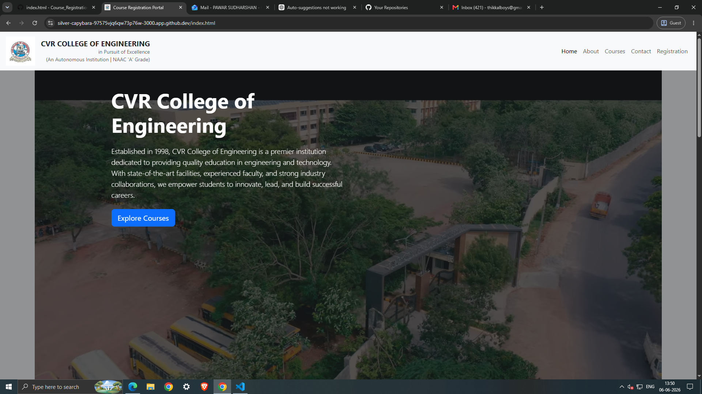
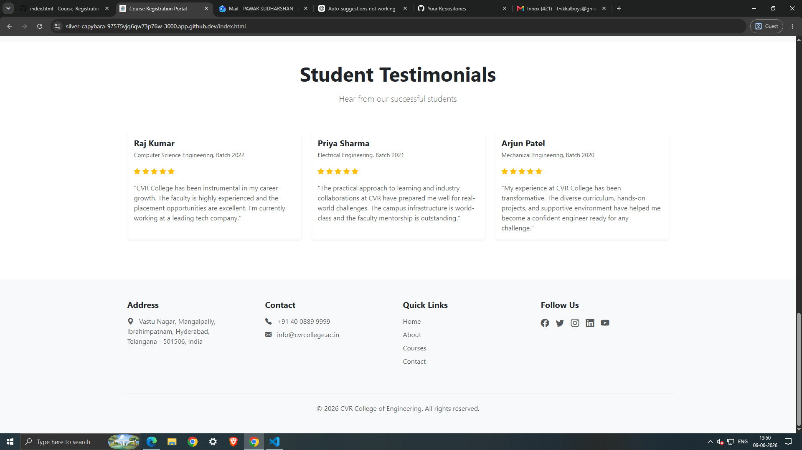
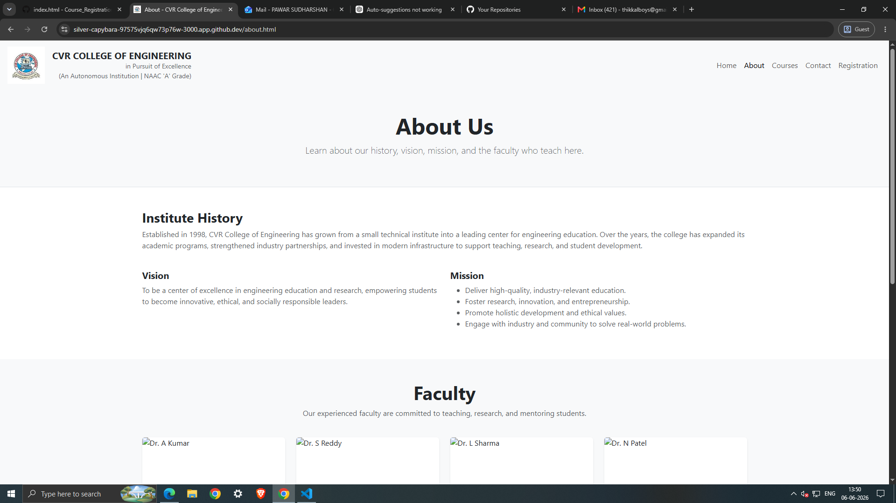
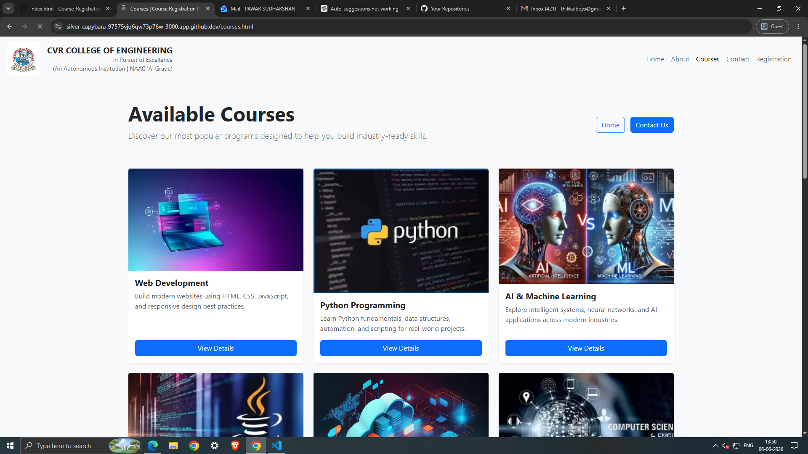
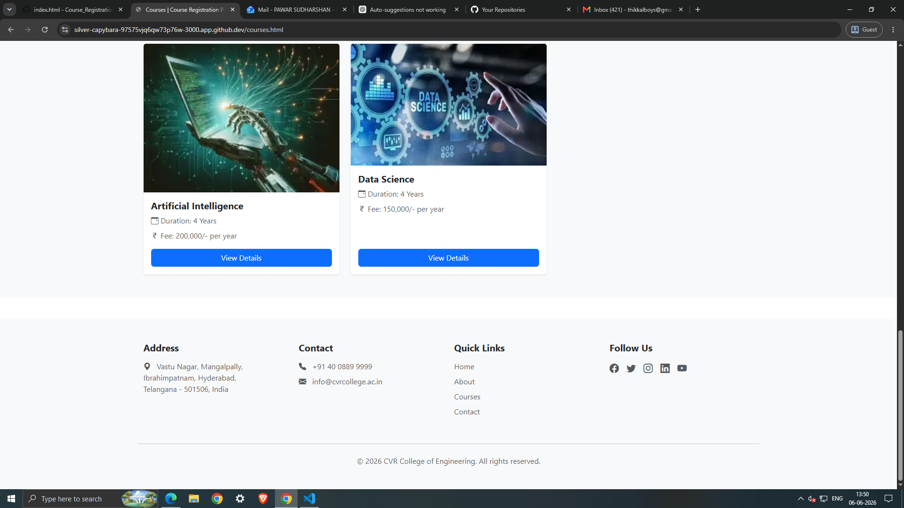
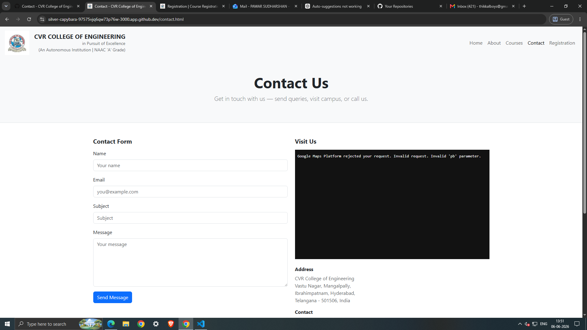
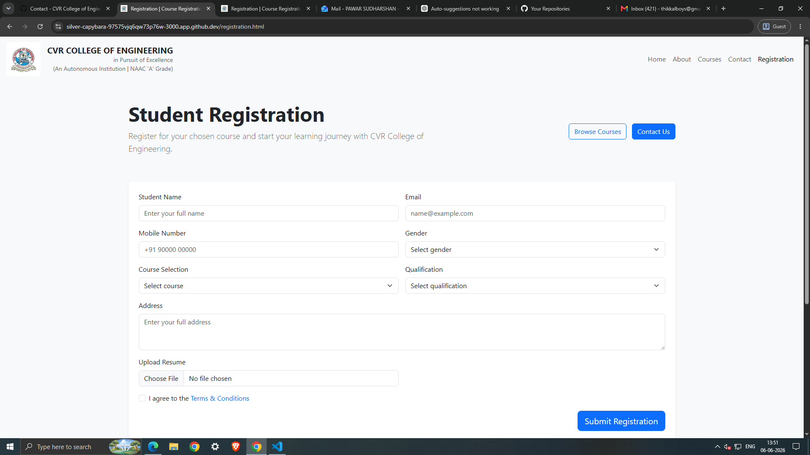

# Course Registration Portal

This repository contains a simple static website for the CVR College Course Registration Portal.

Open `index.html` in a browser to view the site locally.

## Screenshots
The following screenshots demonstrate the site UI. Images are stored in `assets/screenshots/`.

- Screenshot1

- Screenshot2

- Screenshot3

- Screenshot4

- Screenshot5

- Screenshot6

- Screenshot7

- Screenshot8

## Notes
- Replace placeholder images or update paths if you reorganize screenshots.
- To include more screenshots, add them to `assets/screenshots/` and update this README.
